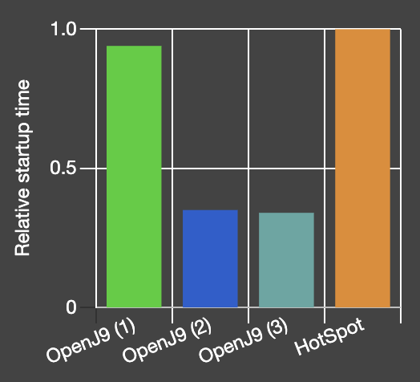
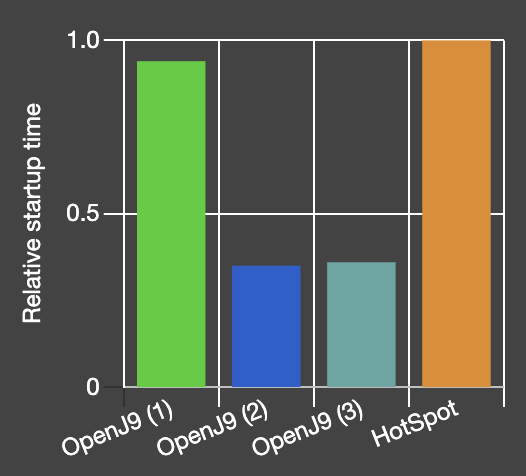
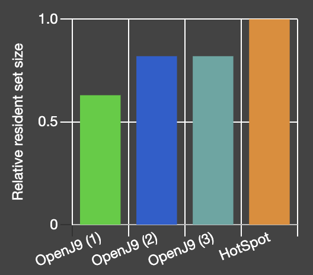
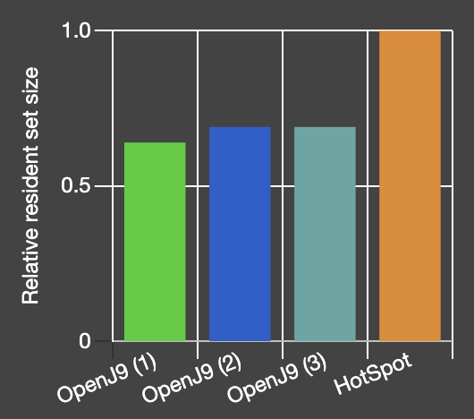
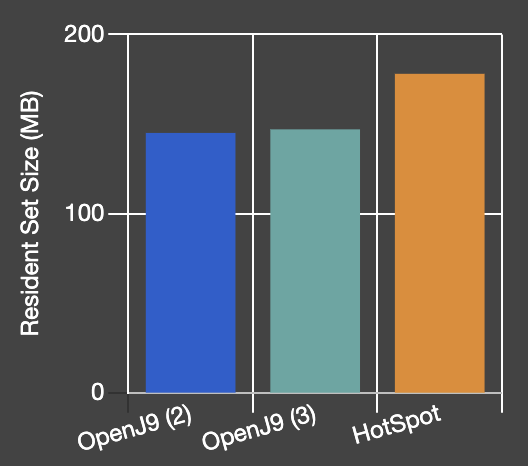
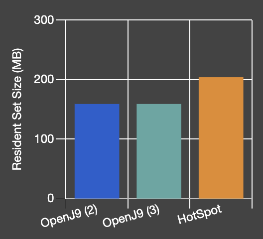
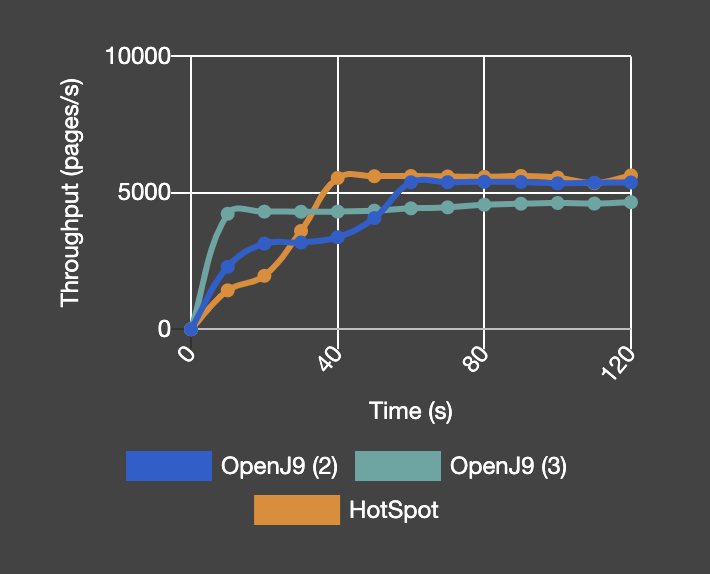
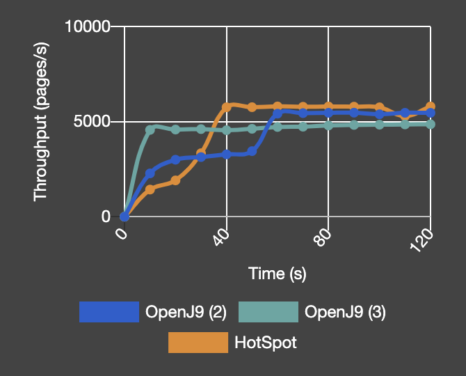

# OpenJDK 11 performance on Quarkus with Eclipse OpenJ9


**When we compared the results of running OpenJDK 11 on Quarkus with either the OpenJ9 VM or the HotSpot VM, OpenJ9 started faster with a smaller footprint.**

We recorded the following results with the REST+CRUD benchmark application:

- **64 - 66% faster startup time**
- **18 - 37% smaller startup footprint**
- **19 - 22% smaller footprint during application ramp-up**
- **Comparable throughput**

The REST+CRUD application (<https://github.com/johnaohara/quarkusRestCrudDemo>) runs on Quarkus 1.3.1-final. Quarkus ([https://quarkus.io](https://quarkus.io/)) is a Kubernetes-native Java framework that is designed to have a low memory footprint and very fast startup. Quarkus can use either a traditional Java VM or a native image. In these tests, we are contrasting Quarkus performance when used with either OpenJ9 or HotSpot VMs.

## Metrics and configurations

Different use cases require different performance characteristics, so we looked at several.

**Startup time:**

Startup time for Quarkus running REST+CRUD is defined as the span between the moment Quarkus is invoked and the moment it is able to serve the first request. Note that the time needed by Docker to start the container is not included.

**Memory footprint after startup:**

Physical memory consumption is measured immediately after startup with the following command: `ps -orss --no-headers -–pid JvmPid.`

**Footprint during load:**

We record the memory consumed by the VM at the end of the load period, because memory utilization stabilizes very quickly due to the nature of the benchmark.

**Ramp-up time:**

As load is applied to the system and the VM compiles more and more methods into native code, throughput improves gradually. Ramp-up time represents the time needed for throughput to reach its peak.

**Peak throughput:**

Peak throughput is defined as the number of transactions processed per second after the VM has fully 'warmed-up'.

To demonstrate the optimizations that are available in the OpenJ9 VM, we ran tests with three different configurations:

1. **OpenJ9 (1)** No options, which represents the out-of-the-box performance. 
2. **OpenJ9 (2)** OpenJ9 with shared class cache (SCC) and dynamic Ahead-of-Time (AOT) technology enabled for all classes (see [tutorial](https://developer.ibm.com/technologies/java/tutorials/j-class-sharing-openj9/)). This configuration can significantly improve startup and ramp-up of Java applications with minimal effect on throughput.
   To take advantage of a SCC when running in a container, you must find some way to persist the data or the cache disappears when the container is destroyed. To achieve this persistence, we enabled SCC/AOT through docker volumes. An alternative option is to create and populate a cache at image build time and store it into the container image. However, in our experience this approach leads to slower startup times than using docker volumes, possibly because of the overhead incurred by the Docker engine when accessing the embedded file system.
3. **OpenJ9 (3)** OpenJ9 with SCC/AOT and `-Xtune:virtualized` enabled. The `-Xtune:virtualized` option is recommended for resource constrained environments that are typically found in the cloud. Under the hood, this option enables the generation of AOT method bodies to the full extent possible, reduces the optimizer aggressiveness, and makes recompilation of AOT bodies less likely. These actions result in lower CPU and memory consumption by the JIT compilation threads. 

With respect to heap settings we ran tests in the following modes:

- Setting only the maximum Java heap size (`-Xmx`).
- Setting the initial Java heap size (`-Xms`) and maximum Java heap size (`-Xmx`) at the same value.

## Startup time

Without an SCC, OpenJ9 and Hotspot show similar results, although OpenJ9 shows a small advantage in some configurations.
However, when we take advantage of the SCC/AOT technology, the startup time reduces considerably and OpenJ9 yields excellent improvements over HotSpot:

- 64 - 66% faster startup.

On the other hand, from the graphs it is apparent that, `-Xtune:virtualized`, an option that we used to recommend for extracting the full start-up benefit of SCC/AOT, is no longer needed. This is due to recent changes in OpenJ9 compilation heuristics to generate AOT method bodies more aggressively during start-up phase and to compile those bodies at "cheap warm" optimization level (like `-Xtune:virtualized` does) instead of "cold".



**Chart: Heap setting "-Xmx128m"**



**Chart: Heap setting "-Xms128m -Xmx128m"**

## Memory footprint after startup

With respect to memory consumption, the OpenJ9 VM has always been associated with a small footprint. The results of our benchmark testing are no exception, in all the configurations tested, OpenJ9 has a clear lead over Hotspot.

- Footprint improvements are smaller than those recorded for [Daytrader7](https://github.com/eclipse/openj9-website/blob/master/benchmark/openjdk11-daytrader7.md), but still substantial, ranging from 18% to 37%.

The presence of the SCC and AOT increases the footprint slightly due to the addition of the cache and because AOT method code are usually slightly larger than the corresponding JIT compiled method bodies.
During the startup phase, OpenJ9 already generates AOT aggressively, so the addition of the `-Xtune:virtualized` option has little effect on footprint.
Finally, for Quarkus we see that the relative advantage of OpenJ9 increases when `-Xms` is also specified on the command line.



**Chart: Heap setting "-Xmx128m"**




**Chart: Heap setting "-Xms128m -Xmx128m"**

## Memory footprint during application ramp-up

Footprint during load is arguably a more important performance metric than footprint after startup. The footprint improvements delivered by OpenJ9 are 19-22%. Interestingly, these improvements are larger when the `-Xms` option is present on the command line. 

As with the previous metrics, the `-Xtune:virtualized` option does not appear to make a difference in the long run. However, it is worth noting that, in a recent change, the maximum amount of memory a compilation thread is allowed to use in the `-Xtune:virtualized` mode has been decreased from 256 MB to 16 MB resulting in a smoother memory consumption behavior, without transient spikes that can increase peak footprint.



**Chart: Heap setting "-Xmx128m"**



**Chart: Heap setting "-Xms128m -Xmx128m"**


## Ramp-up time and peak throughput

Both OpenJ9 with SCC/AOT and HotSpot reach about the same level of peak throughput in the benchmark tests. These results suggest that by running an application on OpenJ9 instead of HotSpot, you can achieve reductions in footprint and startup time without sacrificing throughput.

OpenJ9 with SCC/AOT manages to improve throughput faster than HotSpot for the first 25 seconds, because it can quickly load natively-compiled AOT method bodies from the SCC.
Then, as the JIT compiler starts to consume CPU cycles to upgrade/recompile those AOT bodies, the slope of the throughput curve becomes less steep.
Eventually, after ~50 seconds, the AOT upgrade process subsides and OpenJ9 reaches peak throughput.

The configuration with `-Xtune:virtualized` ramps-up very fast in the beginning because it benefits from more methods being compiled with the dynamic AOT technology.
However, the recompilation process is subdued, and this makes OpenJ9 reach its peak throughput sooner, but at a lower level.
While both OpenJ9 with SCC/AOT and HotSpot settle for about the same peak throughput, the addition of `Xtune:virtualized` degrades peak throughput by about 10%.
Nevertheless, we think that this configuration is very well suited for short or medium running applications where the ability to startup and ramp-up fast is more important than long term throughput.




**Chart: Heap setting "-Xmx128m"**



**Chart: Heap setting "-Xms128m -Xmx128m"**

## Benchmark testing details

You can replicate these results by using equivalent systems and OpenJDK binary files.

### System under test

- desktop machine with 4-core Intel(R) Core(TM) i7-3770K CPU @ 3.50GHz
- Hyperthreading enabled
- 16GB RAM
- CentOS 7.7 operating system

### Benchmark application

For the REST+CRUD application, performance was evaluated by running it in Docker containers (Community Edition version 19.03.8), which were limited to 256 MB of memory and one CPU (`--memory=256M --cpus=1.0`).
Data persistence was ensured by a PostgreSQL 10.5 Docker container. For throughput experiments, load was applied to the Quarkus app by using five JMeter threads.

Unless otherwise specified, OpenJ9 used the default shared classes cache (SCC) size of 64 MB. All performance numbers with AOT enabled were collected with a SCC populated by a previous 'cold' run, which is not included in the measurements.

### OpenJDK binaries

The following binaries were obtained from [AdoptOpenJDK](https://adoptopenjdk.net/) for performance testing:

• **OpenJDK11 with OpenJ9**

```
openjdk version "11.0.8" 2020-07-14
OpenJDK Runtime Environment AdoptOpenJDK (build 11.0.8+3-202005202338)
Eclipse OpenJ9 VM AdoptOpenJDK (build master-78f76052e, JRE 11 Linux amd64-64-Bit Compressed References 20200520_616 (JIT enabled, AOT enabled)
OpenJ9   - 78f76052e
OMR      - 9456c8029
JCL      - cfce36dfff based on jdk-11.0.8+3)
```

• **OpenJDK11 with HotSpot**

```
openjdk version "11.0.7" 2020-04-14
OpenJDK Runtime Environment AdoptOpenJDK (build 11.0.7+10)
OpenJDK 64-Bit Server VM AdoptOpenJDK (build 11.0.7+10, mixed mode)